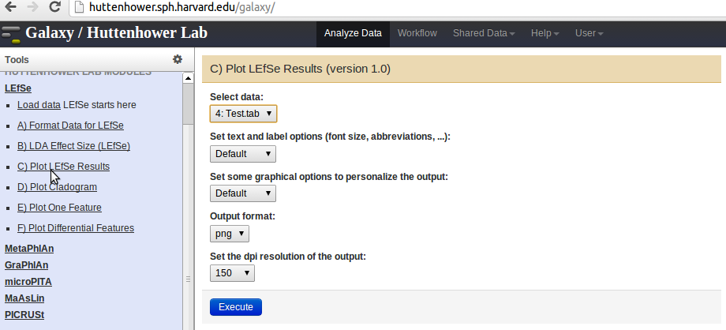

.. _humann_tutorial:

Analyzing metagenomes with HUManN, LEfSe, and GraPhlAn
======================================================

.. include:: ../global.rst

Metagenome files can be submitted for further analysis to `HUMAnN <http://huttenhower.sph.harvard.edu/humann>`_. HUMAnN takes gene abundances as inputs and produces gene and pathway summaries as outputs.

Input for HUMAnN
^^^^^^^^^^^^^^^
HUMAnN can be downloaded from the `website <http://huttenhower.sph.harvard.edu/humann>`_. The input files need to be in the `Tab-Separated Values <http://en.wikipedia.org/wiki/Tab-separated_values>`_ (TSV: ``.tsv``) format.

**Converting QIIME tables to TSV format**

QIIME tables can be converted to TSV using the script `QiimeToMaaslin <http://bitbucket.org/timothyltickle/qiimetomaaslin/src/af63b19d5ff5628cfecca95156e0f639b1c2036b/src/qiimeToMaaslin.py?at=default>`_. To run the script, execute the following command ::

	python qiimeToMaaslin.py metadata.metadata < inputfile.txt > outputfile.tsv

Providing the metadata is optional. For more information, please refer to the `documentation <http://bitbucket.org/timothyltickle/qiimetomaaslin/src/af63b19d5ff5628cfecca95156e0f639b1c2036b/doc/QiimeToMaaslin-ReadMe.txt?at=default>`_.

**Converting BIOM files to TSV format**

BIOM files can be converted to TSV format  using the tools provided by the `biom format <http://biom-format.org/documentation/biom_conversion.html>`_ package (Please refer to the `website <http://biom-format.org/>`_ for more information). Use the following command to convert biom files to TSV format ::

	biom convert -i input_table.biom -o output_table.tsv -b

Please make sure to remove the first line in the output file (output_table.tsv):``# Constructed from biom file``, and save the file in the current format.

Running HUMAnN
^^^^^^^^^^^^^^

The TSV input files can then be copied to the input folder in the HUMAnN repository (i.e. ../humann/input/). To execute HUMAnN, run the following command from the main repository path (i.e. ../humann/) ::

	scons

This command will create an output directory in the main repository (i.e. ../humann/output), which will contain all the analysis results for each input file submitted.

Differential abundance analysis with LEfSe
^^^^^^^^^^^^^^^^^^^^^^^^^^^^^^^^^^^^^^^^^^^

Any of the output HUMAnN files named as: ``04b-*-mpt-*.txt`` or ``04b-*-mpm-*.txt`` can then be used as input for further analysis with `LEfSe <http://huttenhower.sph.harvard.edu/galaxy/root?tool_id=lefse_upload>`_ equivalently. Please follow the instructions below to make the input appropriate for LEfSe,
	* Select a file from the HUMAnN output folder (named ``04b-*-mpt-*.txt`` or ``04b-*-mpm-*.txt``)
	* Open the file in Microsoft Excel or a text editor.
	* Remove the first column.
	* Remove every metadata row (anything including and above InverseSimpson) *except* the class (and optional subclass), and the top row: ID/NAME. 
		* `Please ensure only 1-2 metadata rows remain apart from the Name/ID row at the top`.
	* Save the modifications to the file, and use this version of the file as an input for LEfSe.

1. Load data with LEfSe by clicking on the ``Choose file`` button. Select the **modified output file**, and click on the ``Execute`` button.

.. image:: ../images/load_lefse.png
	:width: 400pt

2. Once the data has been uploaded (the file will appear on the right-hand-side panel), proceed with formatting the data for LEfSe by clicking the link ``Format Data for LEfSe`` in the panel on the left, and selecting the data from the drop-down menu.

.. image:: ../images/format_lefse.png
	:width: 400pt

3. Follow the instructions to select the correct fields in the drop-down menus, and then click on the ``Execute`` button.

.. image:: ../images/execute_lefse.png
	:width: 400pt

5. Once the data is formatted, click on the ``LDA Effect Size`` link in the panel on the left.  Select the **formatted data** from the ``Select Data`` drop-down menu and press ``Execute``.

.. image:: ../images/lda_lefse.png
	:width: 400pt

6. The output generated from the step above can be used as input for the following.
	* Plot the LEfSe results using the ``Plot LEfSe Results`` link in the panel on the left.
	* Plot a Cladogram using the ``Plot Cladogram`` link in the panel on the left. 
	* Plot Differential Features using the ``Plot Differential Features`` link in the panel on the left. 

Visualization with GraPhlAn
^^^^^^^^^^^^^^^^^^^^^^^^^^^^^

Either of the  output files ``04b-*-mpt-*-graphlan_tree.txt`` or ``04b-*-mpm-*-graphlan_tree.txt``  can be used as input for further analysis with `GraPhlAn <http://huttenhower.sph.harvard.edu/graphlan>`_ equivalently.

1. Click the link ``Load input tree`` in the panel on the left, and select the output file from HUMAnN by clicking on the ``Choose file`` button. Press the ``Execute`` button to upload the file.

.. image:: ../images/load_graphlan.png
	:width: 400pt	

2. After the data has been uploaded, click on the ``Annotate tree`` link to add all the graphical features. Then, select the input file from the ``Input File`` drop-down menu. Specify the data fields according to the desired output, and press the ``Execute`` button when done. For example, the fields specified for a figure with leaf node names would be as follows:
	* Select the clades of interest from the list ``Select clade(s)``.
	* Enter ``*`` for the field ``Annotation Label``.
	* Specify ``Clade leaf nodes`` from the drop-down menu ``Annotation Label Clade Selector``.

.. image:: ../images/annotate_graphlan.png
	:width: 400pt

3. Click on the ``Add rings to the tree`` link, and select the annotated data from the above step (instead of your raw input in Step 1) from the ``Input Tree`` drop-down menu. Upload the ``04b-*-graphlan_rings.txt`` file (can be found under /humann/output/) through the ``Get Data`` link (located in the ``LOAD DATA MODULE`` in the panel on the left). Select the ``04b-*-graphlan_rings.txt`` file from the ``Ring input File`` drop-down menu, and press ``Execute``.

.. image:: ../images/rings_graphlan.png
	:width: 400pt

4. To plot the final tree, click on the ``Plot tree`` link in the panel on the left, and select the output from the step above. Press ``Execute``. To visualize the results, click on the **Eye** symbol next to the output file generated in the panel on the right.

.. image:: ../images/plot_graphlan.png
	:width: 400pt
